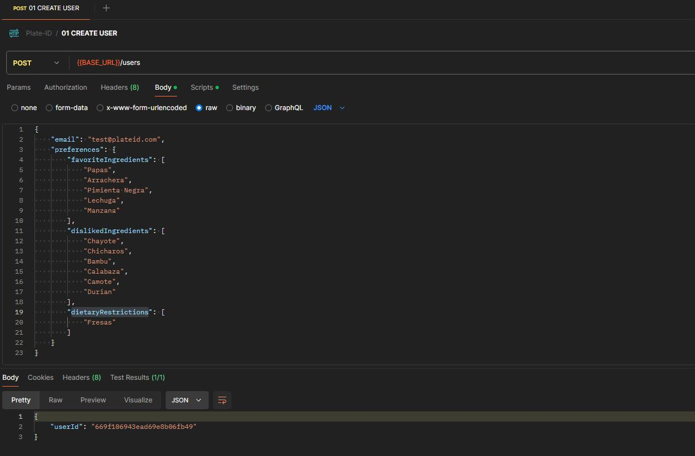
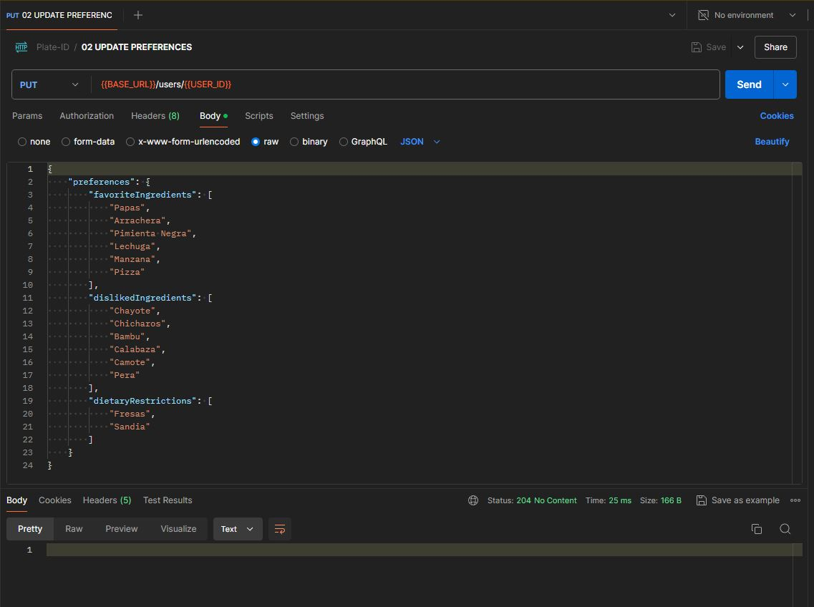
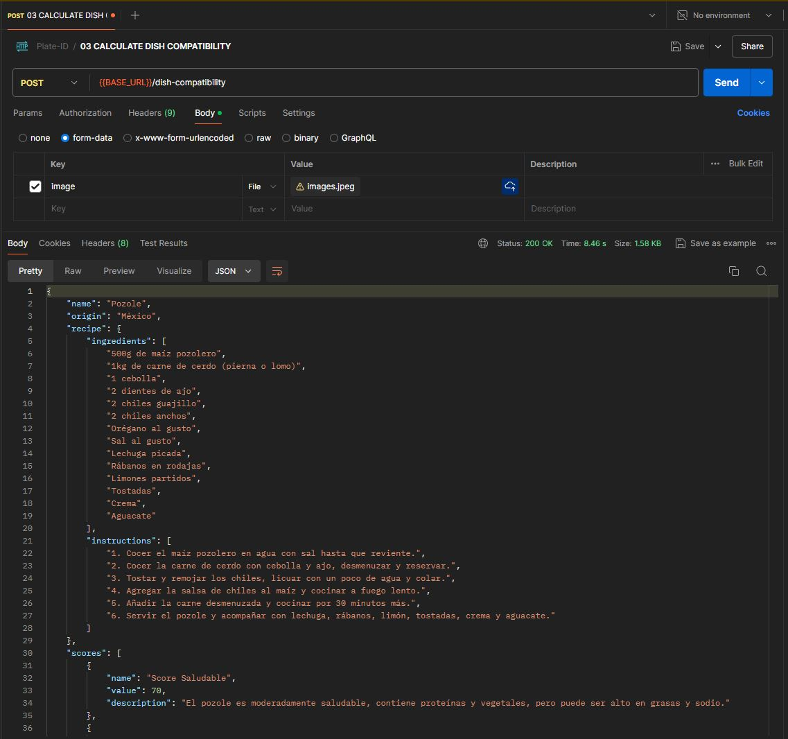

### Plate ID

Plate ID es una innovadora aplicación que utiliza inteligencia artificial para identificar platillos a partir de una imagen y evaluar su compatibilidad con tus gustos personales.

### Requisitos

- Docker
- Postman (opcional)

### Prerequisitos

Sobre el directorio raíz, crear el archivo `.env` tomando como ejemplo el archivo `.env.example` y colocar tu api key de open ia.

```
OPENAI_API_KEY=AQUI_VA_TU_API_KEY_OPEN_IA
```

### Ejecución

Sobre el directorio raíz ejecutar el siguiente comando:

```
docker-compose up
```

### Probar

Abrir Postman e importar la colección `Plate-ID.postman_collection.json`, para probar, ejecutar los endpoint por pasos

**01 - CREATE USER**: Este endpoint se carga con tus preferencias `favoriteIngredients`, `dislikedIngredients` y `dietaryRestrictions` entre mas preferencias cargues mas exactos seran los resultados.


**02 - UPDATE PREFERENCES**: Este endpoint te permite actualizar tus preferencias.


**03 - CALCULATE DISH COMPATIBILITY**: Este endpoint recibe una imagen de algun platillo, con base en esa imagen te dira que tan compatible eres con ese platillo.

